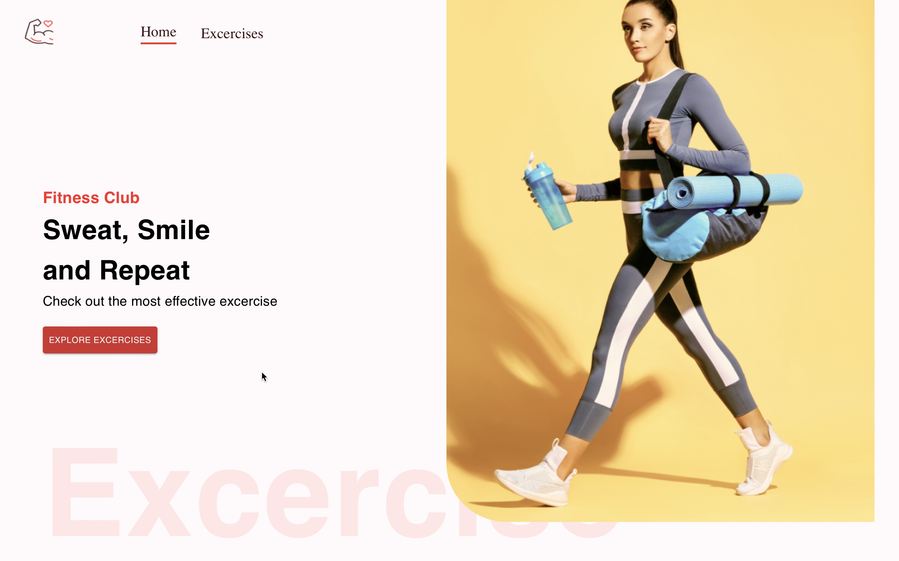

# Gold's Gym Website

## Introduction

### Welcome to the Gold's Gym website project

This React, Material-UI, and API-powered Gold's Gym website is your go-to resource for a comprehensive fitness experience. With the tagline "Unlock Your Potential," our website allows users to explore and discover a wide range of exercises targeting different muscle groups. The platform offers a user-friendly interface with advanced search options, detailed exercise profiles, and the ability to create personalized workouts.

## Key Features

- **Exercise Exploration:** Discover a vast library of exercises categorized by muscle groups for targeted workouts.
- **Effortless Search:** Seamlessly find exercises by name, equipment, or muscle group for a personalized fitness journey.
- **Detailed Exercise Profiles:** Access step-by-step instructions, high-quality images, and video demonstrations for each exercise.
- **Personalized Workouts:** Create and save custom workouts tailored to your fitness goals and schedule.
- **Responsive Design:** Enjoy a modern and seamless experience across all devices.

## Development Challenges and Solutions

During the development phase, we encountered and overcame various challenges:

1. **API Integration:** Successfully integrated APIs to provide real-time exercise data for a dynamic user experience.
2. **Modern UI/UX Design:** Crafted an intuitive and visually appealing user interface for a modern and user-friendly website.
3. **Performance Optimization:** Ensured fast loading times and smooth navigation for content-rich exercise profiles.
4. **Content Curation:** Managed and organized a vast library of exercises while maintaining high-quality content standards.

## Getting Started

### To start exploring and contributing to this project, follow these steps:

1. Clone this repository.
2. Install the necessary dependencies using `npm install`.
3. Configure your environment variables.
4. Launch the development server with `npm start`.

We welcome contributions, bug reports, and feature requests through pull requests and issues. Happy coding!

## 🌐 Connect with Me:

### 
### 
### 
### 

## Screenshot

